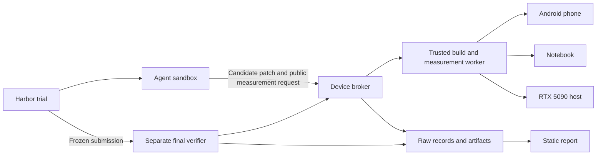

# An agent benchmark for inference on personal hardware

Research date: 2026-09-28. Starling inspected at `6b95f3477f04aef2d0ee99a95132f311fb45de61`; Rtisan at `e3ee7ca12a0d7080fbb84784bda6648c9bb536df`. This is the original research and implementation proposal. See [the README](../README.md) for what is implemented now. No inference trials, device probes, or paid agent runs were performed.

**Recommendation: build a separate repository, starting with one model and one end-to-end optimization task on each device.** The useful question is: “Given the same starting implementation, quality requirements, and experiment budget, how much can an agent improve inference on this device?” Publish the patches and evidence as well as the scores. Successful patches then become candidates for Starling.

This measures the optimizing agent separately from the inference model. Initially, all agents optimize the same fixed Parakeet checkpoint. Each device gets its own results and baseline. The project should make a narrow claim about these workloads and machines; one model on three devices cannot establish general superiority at performance engineering.

The opportunity is credible because the difficult parts already appear in real Starling work. Its research log records isolated GEMV improvements that worsened full decode by 4–7%, different winners on PowerVR and RADV, and thermal drift on unchanged code. Those are useful benchmark challenges. They also show why an isolated kernel score is insufficient. These are recorded historical observations, not measurements reproduced for this investigation. [Starling research log](https://github.com/sims1253/starling/blob/6b95f3477f04aef2d0ee99a95132f311fb45de61/benchmarks/fast_engine/RESEARCH_LOG.md)

The external projects suggest complementary pieces:

| Project | Relevant idea | Application here |
| --- | --- | --- |
| VulcanBench | Real engineering tasks, disclosed evidence, and time/token/cost reporting alongside outcomes | Give agents an actual inference implementation and publish their full experiment economics. Its suite-specific code-quality judging is unnecessary for the performance score. |
| kernelbench.com | Per-GPU results with inspectable solutions and traces; explicit failure categories | Present a device matrix whose cells open the patch, measurements, and trace. |
| Stanford KernelBench | Correctness plus speed relative to a reference; `fast_p` measures the fraction of tasks meeting both requirements | Borrow the quality-gated improvement concept, using end-to-end ASR and statistical uncertainty. |
| MLPerf Mobile/Edge | Defined workloads, quality targets, latency scenarios | Borrow measurement discipline and precise timing boundaries. |

Sources: [VulcanBench](https://vulcanbench.com/), [kernelbench.com](https://kernelbench.com/), [Stanford KernelBench](https://github.com/ScalingIntelligence/KernelBench), [MLPerf Mobile](https://mlcommons.org/benchmarks/inference-mobile/), [MLPerf Edge](https://mlcommons.org/benchmarks/inference-edge/). The kernelbench.com site explicitly states that it is independent of Stanford KernelBench. Stanford's benchmark also includes full-model levels, so whole-model optimization alone is not a new contribution. The proposed distinction is an agent's measured improvement to a deployable speech runtime across consumer devices, with quality and sustained behavior preserved.

**Much of the foundation exists already.** Rtisan was inspected alongside the main Starling checkout. Its README and dependency file pin Harbor to `v0.18.0`. Its execution adapter already translates benchmark cells into Harbor trials, while its reporting code retains result status, usage, and comparison axes. [Rtisan README](https://github.com/sims1253/Rtisan/blob/e3ee7ca12a0d7080fbb84784bda6648c9bb536df/README.md), [dependency pin](https://github.com/sims1253/Rtisan/blob/e3ee7ca12a0d7080fbb84784bda6648c9bb536df/pyproject.toml), [execution adapter](https://github.com/sims1253/Rtisan/blob/e3ee7ca12a0d7080fbb84784bda6648c9bb536df/src/rtisan/execution.py)

| Existing component | Reuse | Work still needed |
| --- | --- | --- |
| Rtisan results, reporting, dashboard | Status taxonomy, provenance, redacted exports, static result pages | Adapt the data model to device measurements; keep Harbor's original artifacts as evidence. |
| Starling `benchmarks/experiments` | Sealed experiment specs, workload hashes, paired comparisons, uncertainty, inconclusive results | Physical-device discovery, scheduling, and stronger timing/verification boundaries. |
| Starling phone scripts | Android builds, deployment, display-state checks, alternating runs, cleanup | Immutable baselines, structured output, authenticated requests, robust recovery. |
| Starling SONAR integration | Per-utterance quality evidence and dataset preparation | Freeze one normalizer and corpus protocol for this benchmark; evaluate actual target-device outputs. |
| Starling fast-engine traces | Useful tasks, candidate controls, known failures | Pin task snapshots and prevent solutions or later commits leaking into agent environments. |

Sources: [Rtisan reporting](https://github.com/sims1253/Rtisan/blob/e3ee7ca12a0d7080fbb84784bda6648c9bb536df/src/rtisan/reporting.py), [dashboard](https://github.com/sims1253/Rtisan/blob/e3ee7ca12a0d7080fbb84784bda6648c9bb536df/src/rtisan/dashboard.py), [experiment protocol](https://github.com/sims1253/starling/blob/6b95f3477f04aef2d0ee99a95132f311fb45de61/benchmarks/experiments/README.md), [paired statistics](https://github.com/sims1253/starling/blob/6b95f3477f04aef2d0ee99a95132f311fb45de61/benchmarks/experiments/stats.py), [phone helpers](https://github.com/sims1253/starling/blob/6b95f3477f04aef2d0ee99a95132f311fb45de61/benchmarks/fast_engine/phone_common.sh), [SONAR adapter](https://github.com/sims1253/starling/blob/6b95f3477f04aef2d0ee99a95132f311fb45de61/benchmarks/sonar/README.md).

Reuse these components selectively. Source inspection found several reasons not to copy the old harness wholesale:

- `phone_gates.sh` refreshes the baseline when the candidate checksum differs from the stored baseline checksum. That can turn a comparison of two builds into an A/A comparison; it prints a warning if their environments also match. The new runner must store baseline and candidate independently and replace the baseline only by an explicit versioned operation. [Baseline refresh logic](https://github.com/sims1253/starling/blob/6b95f3477f04aef2d0ee99a95132f311fb45de61/benchmarks/fast_engine/phone_gates.sh)
- The experiment runner's automatic hardware detection queries NVIDIA, then falls back to CPU identification. It does not establish the Android/Vulkan device and driver identity required here. [Hardware discovery](https://github.com/sims1253/starling/blob/6b95f3477f04aef2d0ee99a95132f311fb45de61/benchmarks/experiments/runner.py)
- Rtisan's generic timeout belongs to its infrastructure-status set. In this benchmark, an agent exhausting its declared task budget must remain a scored failure; a provider outage or disconnected device needs a distinct status and a fixed retry policy. [Result statuses](https://github.com/sims1253/Rtisan/blob/e3ee7ca12a0d7080fbb84784bda6648c9bb536df/src/rtisan/result.py)
- Rtisan has isolation evidence helpers, but some derive expected state from task layout or supplied booleans. These are not proof that a candidate cannot tamper with the grader. Use executable adversarial controls. [Isolation helpers](https://github.com/sims1253/Rtisan/blob/e3ee7ca12a0d7080fbb84784bda6648c9bb536df/src/rtisan/harbor_isolation.py)

**Harbor should own agent execution; a small service should own the hardware.** Harbor supplies task/trial lifecycle and agent integration. The new project's durable contribution is reproducible measurement on these devices, including exclusive leases, build provenance, quality gates, and publication.

Harbor source was inspected at `a38eb549b5f3c33d16ccd5c51734b0defff8399e` (package version `0.23.0`) and compared with Rtisan's `v0.18.0`, commit `527d50deb63a5d279e8c20593c18a2cbc7f61f9e`. Separate verifier environments, custom imports, and phase network policies already existed in the older version. A useful later addition is artifact-only regrading: repeat final verification without paying for another agent attempt, provided the required artifacts are complete. Pin a tested commit; the current trajectory source defaults to ATIF v1.8 while its documentation still describes v1.7. [Version comparison](https://github.com/harbor-framework/harbor/compare/v0.18.0...a38eb549b5f3c33d16ccd5c51734b0defff8399e), [regrade implementation](https://github.com/harbor-framework/harbor/blob/a38eb549b5f3c33d16ccd5c51734b0defff8399e/src/harbor/trial/regrade.py), [trajectory schema](https://github.com/harbor-framework/harbor/blob/a38eb549b5f3c33d16ccd5c51734b0defff8399e/src/harbor/models/trajectories/trajectory.py), [ATIF documentation](https://docs.harborframework.com/core-concepts/agents/atif).

Three integration details determine the design:

- Built-in Docker declares GPU support false, and Harbor rejects a positive GPU allocation for an unsupported provider. Custom Compose device mappings or another provider are possible avenues, but a task setting alone does not connect the RTX 5090. [Docker capabilities](https://github.com/harbor-framework/harbor/blob/a38eb549b5f3c33d16ccd5c51734b0defff8399e/src/harbor/environments/docker/docker.py), [capability validation](https://github.com/harbor-framework/harbor/blob/a38eb549b5f3c33d16ccd5c51734b0defff8399e/src/harbor/environments/base.py)
- Separate verification is opt-in. In a single-step trial, Harbor collects artifacts and stops the agent environment before grading, but uses the same environment provider for the verifier. A different verifier image does not switch from Docker to Android. A custom host-side `BaseVerifier` calling the device broker is a smaller initial integration than implementing a whole new `BaseEnvironment`. Prototype its artifact handoff and regrade behavior before committing to the interface. [Separate verifiers](https://docs.harborframework.com/core-concepts/tasks/separate-verifier), [custom verifiers](https://docs.harborframework.com/core-concepts/jobs/custom-verifiers), [single-step lifecycle](https://github.com/harbor-framework/harbor/blob/a38eb549b5f3c33d16ccd5c51734b0defff8399e/src/harbor/trial/single_step.py), [environment construction](https://github.com/harbor-framework/harbor/blob/a38eb549b5f3c33d16ccd5c51734b0defff8399e/src/harbor/trial/trial.py)
- Harbor Hub can publish configurable leaderboards linked to trials, but the project must calculate the row metrics. It does not replace the statistical comparator. Usage and cost fields can be absent; report unknown values as unknown. [Hub leaderboards](https://docs.harborframework.com/core-concepts/harbor-hub/leaderboards), [trajectory metrics](https://github.com/harbor-framework/harbor/blob/a38eb549b5f3c33d16ccd5c51734b0defff8399e/src/harbor/models/trajectories/final_metrics.py)

The independent kernelbench.com source offers another useful precedent: it separates live diagnostic measurements from isolated final regrades and requires publication audits. Its current Hard/Mega/CUDA decks allow unlimited wall time, so their results answer a different question from the proposed fixed-budget campaign. Its spec also acknowledges that candidate Python executing in the checker's interpreter is not an authority boundary. Adopt the regrading practice while designing stronger separation for native candidates. Inspected revision: `287c7c05e8c933423c606a2cb25b0180e3a3b120`. [Run protocol](https://github.com/Infatoshi/kernelbench.com/blob/287c7c05e8c933423c606a2cb25b0180e3a3b120/AGENTS.md), [README](https://github.com/Infatoshi/kernelbench.com/blob/287c7c05e8c933423c606a2cb25b0180e3a3b120/README.md), [Hard specification](https://github.com/Infatoshi/kernelbench.com/blob/287c7c05e8c933423c606a2cb25b0180e3a3b120/benchmarks/hard/SPEC.md).



The broker accepts a candidate identifier, device, and allowed workload identifier. It grants one lease per physical device, enforces measurement limits, and returns logs and structured observations. It does not expose unrestricted host commands, SSH credentials, ADB, or private evaluation data to the agent. Build work must also avoid contending with notebook measurements. Missing hardware ends in `unavailable`, with a recorded reason.

The build worker reconstructs the candidate from an immutable source snapshot plus an allowlisted patch. The supervisor owns timing and completion checks. Candidate-reported timing is useful for profiling but cannot determine the official score. Run the candidate under a separate restricted identity from the controller and scorer. Hidden reference transcripts stay outside that identity. Validate this boundary with candidates that try to write rewards, skip work, or access reference data.

Android is the largest implementation uncertainty. Existing ADB scripts provide a practical development runner, but candidates launched under the same shell identity do not establish an adversarial isolation boundary. A restricted Android execution service needs a feasibility spike on the actual phone and driver. Until that works, label phone results as supervised research runs and audit the submitted code. Do not present an ADB prototype as a secure public submission service.

**Use Parakeet-TDT-0.6B-v3 for the first model.** Starling already has native CPU/GPU paths, a specialized Vulkan engine, Android deployment, and quality tooling for it. A smaller non-LLM decoder keeps the first campaign manageable. The model card identifies it as a multilingual FastConformer-TDT model. Add MOSS second to test autoregressive decode and weight-bandwidth optimizations. [Starling fast engines](https://github.com/sims1253/starling/blob/6b95f3477f04aef2d0ee99a95132f311fb45de61/docs/fast-engine.md), [Parakeet model card](https://huggingface.co/nvidia/parakeet-tdt-0.6b-v3)

The following device identities come from Starling's documents. Confirm them during worker registration; this investigation did not query connected hardware. [Device notes](https://github.com/sims1253/starling/blob/6b95f3477f04aef2d0ee99a95132f311fb45de61/docs/fast-engine.md), [program status](https://github.com/sims1253/starling/blob/6b95f3477f04aef2d0ee99a95132f311fb45de61/docs/program/STATUS.md)

| Initial task | Proposed backend | Objective |
| --- | --- | --- |
| Parakeet on Pixel 10 Pro, Tensor G5/PowerVR | Native Vulkan plus the existing CPU decoder | Reduce warm transcription latency while preserving quality and sustained performance. |
| Parakeet on Ryzen 5 PRO 5650U/Vega 7 notebook | Native Vulkan/CPU with a declared configuration | Reduce the same latency metric under a fixed resource budget. |
| Parakeet on RTX 5090 host | Native ggml CUDA | Reduce batch-one latency; add a separate throughput task later. |

Before freezing the CUDA task, measure its baseline against the existing Python/CUDA implementation. If a task requires native deployment, say so. Do not advertise a win over a weak reference as a win over the fastest available implementation. Likewise, use the current optimized Vulkan path as the relevant phone baseline, with older generic paths shown only as context.

Freeze one checkpoint, conversion recipe, GGUF hash, and decoding configuration that run on all three devices. Different kernels and device-specific patches are allowed. V0 should keep weights and quantization fixed; quantization changes introduce a second optimization problem and belong in a later quality-constrained track. Engine choice, CPU/GPU placement, and compiler settings must be declared and scored against the matching starting configuration. NPU integration, new model architectures, and streaming semantics can follow after the first campaign.

**A useful score requires more than a faster median.** Register the protocol before giving tasks to agents:

1. Use distinct public development and final evaluation inputs. Include varied utterance lengths, speakers, silence, and supported languages such as English and German. The three existing tiled fixtures are smoke tests, not the headline corpus. Commit to the final manifest before the campaign, keep it outside agent workspaces, and release it afterward where redistribution permits. Call public-corpus holdouts “withheld during this run”; do not claim training-data absence.
2. Measure from trusted receipt of an already-decoded PCM request to delivery of the final transcript, with GPU completion required. Exclude transport to the device from this metric. Separately report model load/initialization, first inference, conversion/build time, and cold-cache behavior; include any candidate-specific setup in the appropriate measure. Preloading model weights is permitted for the warm task; precomputing answers is not.
3. Run baseline and candidate serially in randomized, balanced A/B blocks. Preserve raw observations and bootstrap paired blocks, accounting for process/session correlation. Separate short warm latency from a fixed sustained-use window. Record thermal state, power mode, charging, display state, and backend identity. Calibrate repetition counts using A/A runs before freezing the benchmark.
4. Freeze the transcript normalizer. Check fixture parity, held-out corpus word error rate (WER), and the declared output contract, including punctuation or timestamps if supported by the task. Require a preregistered quality noninferiority margin, with uncertainty on the paired WER difference. Starling's historical 0.2 percentage-point gate is a candidate starting value, not a justified universal threshold. A small corpus may be unable to establish such a tight margin.
5. A win needs a quality pass and a latency confidence interval that clears a minimum worthwhile improvement. Publish failures, regressions, and inconclusive results. If a suite-level rate is needed, use the fraction of all scored trials clearing both gates at a published threshold, inspired by `fast_p`. Do not rank by geometric mean over only the successes. Report device outages and reruns separately, including their counts.
6. Freeze the submitted patch before final grading. Repeated public tuning measurements are development evidence; an independent final run determines the result. Record unsuccessful attempts and enforce the same experiment budget. Do not select whichever thermal window produces the best number.

For each result, report baseline and candidate latency, speedup with uncertainty, WER and its difference, sustained behavior, peak memory where measurable, and optimization cost. Separate agent/API time, compilation time, device occupancy, and queue delay. A phone battery-gauge estimate and GPU board-power telemetry cover different boundaries; show method and uncertainty, and do not combine them into a cross-device energy ranking. Starling's current phone script explicitly uses nominal voltage and an idle-subtracted charge-counter estimate. [Energy method](https://github.com/sims1253/starling/blob/6b95f3477f04aef2d0ee99a95132f311fb45de61/benchmarks/fast_engine/phone_energy.sh)

**Build one complete trial before building a broad suite.** A sensible sequence for the new repository is:

1. Define a task manifest and result schema. Pin source, submodule, weights, corpus, build environment, backend, and timing boundaries. Implement the notebook worker and one manual candidate, then generate a static report from saved evidence.
2. Add exclusive device leases, Android deployment, and the RTX host worker. Verify cleanup, disconnect handling, thermal rejection, and independent baseline storage. Run A/A controls and a known real optimization; injected sleep is suitable only for testing the measurement plumbing.
3. Connect one Harbor agent and a separate verifier. Validate patch extraction/rebuild, public measurement feedback, budget enforcement, and final regrading from the saved artifact.
4. Challenge the grader with known-bad submissions: constant transcript, truncated work, timing fabrication, reward-file edits, baseline mutation, and lingering background processes. Record which defenses are enforced and which depend on supervised review.
5. Run an initial matrix of two fixed agent configurations × three devices × three independent attempts: 18 optimization episodes. A proposed one-hour active budget per episode caps agent-active time at 18 hours; queueing, device cooldown, builds outside that budget, and final grading add time. Fix those accounting rules explicitly. Price one pilot episode before estimating API cost for the full campaign.

Do not call these 18 episodes 18 independent engineering problems: there is one model and three closely related tasks. The first publication is a case study with all repetitions visible. Broaden the suite only after the measurement system and task difficulty are understood. A device-transfer table for submitted patches would be a useful follow-up: a patch optimized for one device may help or hurt another.

The repository can stay small:

```text
tasks/                 Harbor tasks and immutable workload specifications
workers/               Build, device control, telemetry, cleanup
verifier/              Quality checks, timing validation, scoring
schemas/               Task, device, measurement, and publication schemas
campaigns/             Agent configurations, budgets, seeds
reports/               Static pages generated from versioned result indexes
```

Keep large binaries, audio, and raw traces in versioned artifact storage referenced by hashes. Each published row should link to source and patch, build recipe, weight/corpus identifiers, raw samples, quality outputs, device/driver details, agent configuration, trace, and measured or explicitly estimated cost. Separate the immutable evaluation release from Starling's moving development branch. Published historical tasks and solutions are useful for reproducibility but should not be sold as uncontaminated tests of future agents.

The first decision gate is practical: can one frozen candidate be rebuilt and independently regraded on all three devices with stable baselines and trustworthy quality checks? If yes, this is worth expanding. If not, a narrower notebook/RTX campaign still produces useful infrastructure while Android remains an explicitly experimental track.
